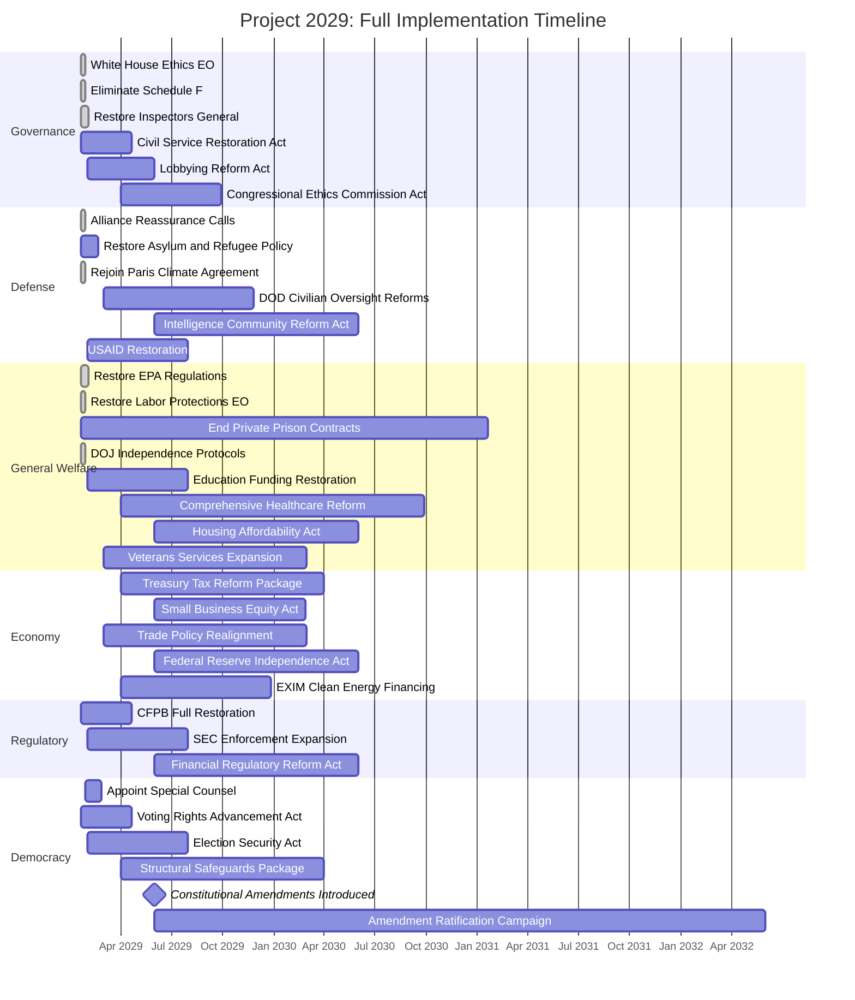
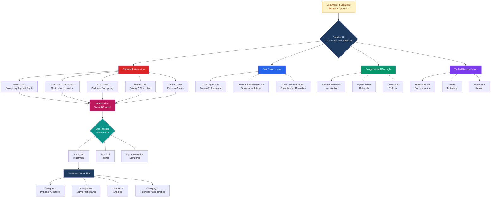
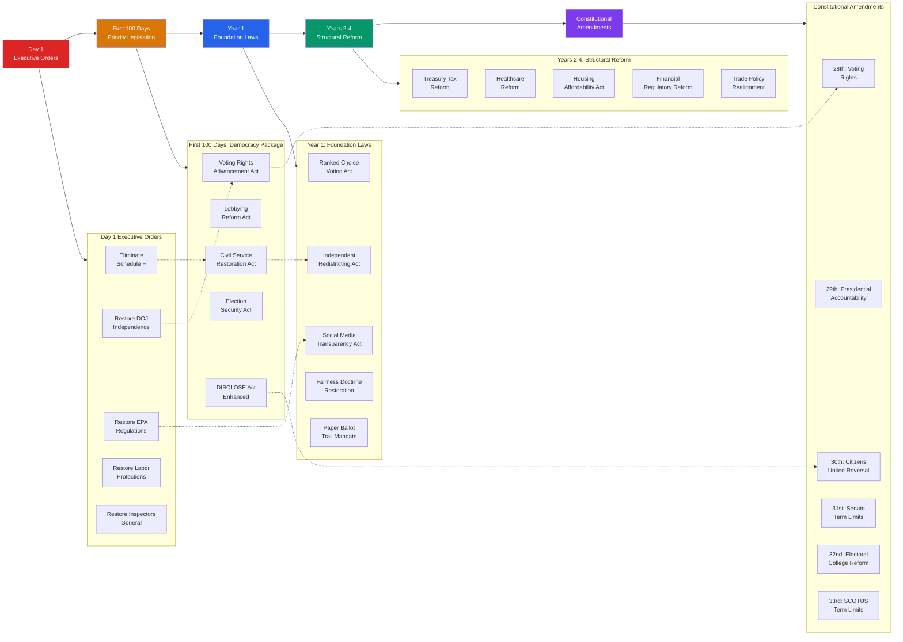

# Project 2029: Strategic Diagrams

This page presents visual diagrams mapping the structure, timeline, legal framework, and legislative priorities of Project 2029. Each diagram is rendered using [Mermaid](https://mermaid.js.org/) syntax via the Docsify Mermaid plugin.

> **Note:** These diagrams require the Docsify Mermaid plugin to render. If viewing the raw Markdown file, you will see the Mermaid source code rather than rendered diagrams.

---

## 1. Implementation Timeline

The following Gantt chart maps Project 2029's full implementation timeline from Inauguration Day (January 20, 2029) through the end of the first presidential term. Actions are organized by the six major sections of the blueprint.

**Key milestones:**
- **Day 1 (Jan 20, 2029):** Executive Order blitz -- ethics, civil service, environment, labor, DOJ independence
- **Day 90 (Apr 20, 2029):** First 100 days legislation -- voting rights, anti-corruption, civil service reform
- **Year 1:** Foundation legislation across all sections
- **Years 2-4:** Consolidation, structural reforms, constitutional amendment ratification campaign

---

## 2. Government Structure

This organizational chart maps all 31 chapters to their place within federal government structure, organized by Project 2029's six sections.

```mermaid
graph TD
    POTUS["President of the United States"]

    POTUS --> S1["Section 1: Good Governance"]
    POTUS --> S2["Section 2: Common Defense"]
    POTUS --> S3["Section 3: General Welfare"]
    POTUS --> S4["Section 4: The Economy"]
    POTUS --> S5["Section 5: Regulatory Agencies"]
    POTUS --> S6["Section 6: Safeguarding Democracy"]

    S1 --> CH1["Ch 1: White House Office"]
    S1 --> CH2["Ch 2: Executive Office / OMB / NSC"]
    S1 --> CH3["Ch 3: Personnel Agencies / OPM / MSPB"]

    S2 --> CH4["Ch 4: Department of Defense"]
    S2 --> CH5["Ch 5: Homeland Security"]
    S2 --> CH6["Ch 6: Department of State"]
    S2 --> CH7["Ch 7: Intelligence Community"]
    S2 --> CH8["Ch 8: Media Agencies"]
    S2 --> CH9["Ch 9: USAID"]

    S3 --> CH10["Ch 10: Agriculture"]
    S3 --> CH11["Ch 11: Education"]
    S3 --> CH12["Ch 12: Energy"]
    S3 --> CH13["Ch 13: EPA"]
    S3 --> CH14["Ch 14: HHS"]
    S3 --> CH15["Ch 15: HUD"]
    S3 --> CH16["Ch 16: Interior"]
    S3 --> CH17["Ch 17: Justice"]
    S3 --> CH18["Ch 18: Labor"]
    S3 --> CH19["Ch 19: Transportation"]
    S3 --> CH20["Ch 20: Veterans Affairs"]

    S4 --> CH21["Ch 21: Commerce"]
    S4 --> CH22["Ch 22: Treasury"]
    S4 --> CH23["Ch 23: Export-Import Bank"]
    S4 --> CH24["Ch 24: Federal Reserve"]
    S4 --> CH25["Ch 25: Small Business Admin"]
    S4 --> CH26["Ch 26: Trade Policy"]

    S5 --> CH27["Ch 27: Financial Regulatory Agencies"]

    S6 --> CH28["Ch 28: Legal Accountability"]
    S6 --> CH29["Ch 29: Structural Safeguards"]
    S6 --> CH30["Ch 30: Fundamental Transformation"]
    S6 --> CH31["Ch 31: Constitutional Hardball"]

    style POTUS fill:#1e3a5f,color:#fff,stroke:#0d2137
    style S1 fill:#2563eb,color:#fff
    style S2 fill:#dc2626,color:#fff
    style S3 fill:#059669,color:#fff
    style S4 fill:#d97706,color:#fff
    style S5 fill:#7c3aed,color:#fff
    style S6 fill:#be185d,color:#fff
```

**Section overview:**
- **Section 1 (Blue):** Restoring ethical governance and civil service protections
- **Section 2 (Red):** National security, defense, diplomacy, and foreign aid
- **Section 3 (Green):** Domestic agencies serving the general welfare (11 chapters)
- **Section 4 (Gold):** Economic policy, trade, and financial institutions
- **Section 5 (Purple):** Independent financial regulatory agencies (CFPB, SEC, FDIC)
- **Section 6 (Magenta):** Democratic accountability, structural reform, and constitutional amendments

---

## 3. Legal Accountability Chain

This flowchart maps the accountability framework from Chapter 28, showing how documented violations flow through investigation, prosecution, and remedy pathways.

**Key principles from Chapter 28:**
- Accountability is evidence-based, not political revenge
- First Amendment protects policy advocacy; criminal conduct is not protected
- Due process safeguards (5th, 6th, 14th Amendments) apply at every stage
- Tiered system distinguishes architects from followers, allowing cooperation agreements
- Independent Special Counsel ensures separation from political leadership

---

## 4. Legislative Priority Matrix

This diagram shows how legislative priorities flow from immediate executive actions through foundation laws to long-term structural reform, organized by policy domain.

**How to read this diagram:**
- **Solid arrows** show the temporal flow from immediate actions to long-term reform
- **Dotted arrows** show how specific executive orders lay groundwork for later legislation
- **Subgraph boxes** group related legislative actions by timeline phase
- The 6 proposed constitutional amendments represent the most ambitious structural reforms, requiring 2/3 congressional approval and 3/4 state ratification

---

## Cross-References

- [First 100 Days Checklist](Implementation_Checklists/First_100_Days_Checklist.md) -- detailed Day 1-100 action items
- [Year 1-4 Implementation Roadmap](Implementation_Checklists/Year_1_4_Implementation_Roadmap.md) -- full multi-year tracking
- [Master Legislative Requirements](Master_Legislative_Requirements.md) -- all 90+ proposed federal laws
- [Chapter 28: Legal Accountability](../Section6_Safeguarding_Democracy_And_Accountability/Chapter_28_Legal_Accountability_for_Subversion_of_Democracy.md) -- full accountability framework
- [Chapter 30: Fundamental Transformation](../Section6_Safeguarding_Democracy_And_Accountability/Chapter_30_Fundamental_Democratic_Transformation.md) -- constitutional amendment proposals
